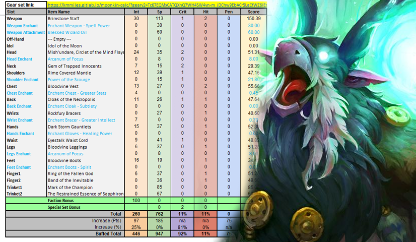
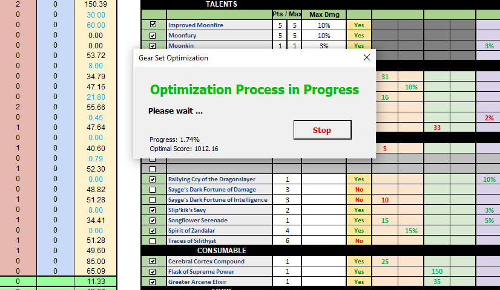

&nbsp;&nbsp;
&nbsp;&nbsp;

# "By the great winds, I come." Classic Balance Druid Spreadsheet v1.8

One of the most advanced World of WarCraft Classic theorycraft resources for Balance Druid:

- Optimize your gear selection through various presets
- Determine your optimal trinket rotation through the trinket optimizer
- Emulate specific encounter scenarios (duration, buffs, debuffs, etc.)
- Gauge your Moonkin Aura DPS contribution to your party and raid
- Visualize how stats from gear, buffs, world buffs, and more adjusts your critical stat weights
- Save and publish your gear sets for later use or comparison
- Utilize high-risk, high-reward tables to maximize your gameplay
- Add or remove gear which you've collected to optimize any preset specifically for <b><i>YOUR</i></b> in game scenario
- And more...!

This spreadsheet is a resource which is primarily for Excel to utilize the power and functionality of VBA macros. <b>You will not be able to use this tool in Google Docs!</b>

  ---
  

<a href="#About"><b>About</b></a>&nbsp;|&nbsp;
<a href="#Spreadsheet"><b>Spreadsheet</b></a>&nbsp;|&nbsp;
<a href="https://www.paypal.com/paypalme2/keftenk?locale.x=en_US"><b>Target Spell Resistance</b></a>&nbsp;|&nbsp;
<a href="https://www.paypal.com/paypalme2/keftenk?locale.x=en_US"><b>Web Application</b></a>&nbsp;|&nbsp;
<a href="https://www.paypal.com/paypalme2/keftenk?locale.x=en_US"><b>FAQ</b></a>&nbsp;|&nbsp;
<a href="https://www.paypal.com/paypalme2/keftenk?locale.x=en_US"><b>Author Notes</b></a>&nbsp;|&nbsp;
<a href="https://www.paypal.com/paypalme2/keftenk?locale.x=en_US"><b>Donation</b></a>&nbsp;|&nbsp;
<a href="https://www.paypal.com/paypalme2/keftenk?locale.x=en_US"><b>Credit</b></a>&nbsp;|&nbsp;

 

  ---

# About

This project was developed not out of the desire to play the Moonkin myself, but to justifiably refute accusations within the community as to how Balance Druid performs in a raid environment and if there was any validity to the claims players would make or if everything was hearsay. I went in with a unbiased opinion of the specs performance and detailed the process backed by mathematics. I can say with enough assurance that I can speak to the Balance Druid better than most. I hope you all can appreciate and enjoy the resource.

Balance Druid's stereotype which has carried through to today has been the notion that they run out of mana exceedingly fast, being coined "OOMkin". This is a verifiably false statement with the capability of being able to last nearly 5-minutes in the current state of the game. In hindsight Smite Priest, Shadow Priest, as well as Elemental Shaman have more mana management opportunities.

Moonkin as well as the Druid talent tree revamp came very late in the progression of Vanilla. The understanding and knowledge of the specialization couldn't be fully realized even partially through the evolution of the game due to these changes. In tandem with a bottom tier played class made for stand out research and data building incredibly sparse and inconsistent.

  ---

# Spreadsheet

By utilizing VBA macros you may optimize your gear down to the exact value of Hit%, Crit%, INT, Spell Damage, Faction, Classic Phase#, Spell Rank#, Buffs, and Debuffs. This is achievable by clicking "Finding Optimal Gear Set" and "Exact Optimization" features present on the 'Character' sheet. Stat weights will automatically correct and reoptimize using the math derivatives which have been written for the tool. You are also able to optimize your trinkets per durational boss fights if you so wish which then can be fed back into your 'Character' optimization.

The Score function is the culmination of the stat weights via each individual item which has been selected. All of these parameters can be saved and called upon at a later load of the resource.

The spreadsheet also comes equipped with a rough estimation of the DPS that you may be able to produce with the given parameters. Please do note that this is not a perfect simulation of damage and does have a inherent margin of error which comes with it.

If your desire is to to explore a more relative DPS Simulation tool, please consider utilizing Beef Broccoli's Moonkin Calculator Tool.

By the grace of Zephan from the Classic Warlock Discord. We've also constructed a rough estimation of the DPS contribution in which the Moonkin Aura may end up resulting to. Much like the DPS calculations this is not a perfect simulation.

  ---
 
 

  

 
### Boy Scout Rule

I love open source.  I am not a heavy maintainer of any large libraries, but I really like the boyscout rule.  I contribute to things as I come across issues that I think other people might struggle with.  This may be things that are overlooked by someone who is deep into the library.  I 💕 a good onboarding readme with good example.

 ---

  

### My Digital Garden 🌱

I write regular blog posts, most of which you will find on my personal website [waylonwalker.com](https://waylonwalker.com) and [dev.to/waylonwalker](https://dev.to/waylonwalker).

I write about things I am familiar with, things that trip up folks that I mentor, and things that I am learning.  Day to day I make things with **data** using **python** and **javascript**. 

[Latest Post 👉](https://waylonwalker.com/latest)

 
<strong>other favorite posts</strong>

 
 
 
 

💌 Sign up for my [newsletter](https://waylonwalker.com/newsletter/)

---
