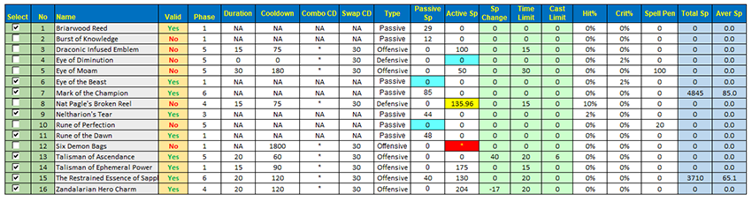

&nbsp;&nbsp;
&nbsp;&nbsp;

# "By the great winds, I come." Classic Balance Druid Spreadsheet v1.8

One of the most advanced World of WarCraft Classic theorycraft resources for Balance Druid:

- Optimize your gear selection through various presets
- Determine your optimal trinket rotation through the trinket optimizer
- Emulate specific encounter scenarios (duration, buffs, debuffs, etc.)
- Gauge your Moonkin Aura DPS contribution to your party and raid
- Visualize how stats from gear, buffs, world buffs, and more adjusts your critical stat weights
- Save and publish your gear sets for later use or comparison
- Utilize high-risk, high-reward tables to maximize your gameplay
- Add or remove gear which you've collected to optimize any preset specifically for <b><i>YOUR</i></b> in game scenario
- And more...!

This spreadsheet is a resource which is primarily for Excel to utilize the power and functionality of VBA macros. <b>You will not be able to use this tool in Google Docs!</b>

  ---
  

<a href="#About"><b>About</b></a>&nbsp;|&nbsp;
<a href="#Spreadsheet"><b>Spreadsheet</b></a>&nbsp;|&nbsp;
<a href="#Spell Resistance"><b>Target Spell Resistance</b></a>&nbsp;|&nbsp;
<a href="https://www.paypal.com/paypalme2/keftenk?locale.x=en_US"><b>Web Application</b></a>&nbsp;|&nbsp;
<a href="https://www.paypal.com/paypalme2/keftenk?locale.x=en_US"><b>FAQ</b></a>&nbsp;|&nbsp;
<a href="https://www.paypal.com/paypalme2/keftenk?locale.x=en_US"><b>Author Notes</b></a>&nbsp;|&nbsp;
<a href="https://www.paypal.com/paypalme2/keftenk?locale.x=en_US"><b>Donation</b></a>&nbsp;|&nbsp;
<a href="https://www.paypal.com/paypalme2/keftenk?locale.x=en_US"><b>Credit</b></a>&nbsp;|&nbsp;

 

  ---

# About

This project was developed not out of the desire to play the Moonkin myself, but to justifiably refute accusations within the community as to how Balance Druid performs in a raid environment and if there was any validity to the claims players would make or if everything was hearsay. I went in with a unbiased opinion of the specs performance and detailed the process backed by mathematics. I can say with enough assurance that I can speak to the Balance Druid better than most. I hope you all can appreciate and enjoy the resource.

Balance Druid's stereotype which has carried through to today has been the notion that they run out of mana exceedingly fast, being coined "OOMkin". This is a verifiably false statement with the capability of being able to last nearly 5-minutes in the current state of the game. In hindsight Smite Priest, Shadow Priest, as well as Elemental Shaman have more mana management opportunities.

Moonkin as well as the Druid talent tree revamp came very late in the progression of Vanilla. The understanding and knowledge of the specialization couldn't be fully realized even partially through the evolution of the game due to these changes. In tandem with a bottom tier played class made for stand out research and data building incredibly sparse and inconsistent.

  ---

# Spreadsheet

By utilizing VBA macros you may optimize your gear down to exact value of a stat such as: Spell Hit, Spell Crit, Spell Damage, and more. This can be achieved by selecting your desired parameters in the <b>Character Selection</b> row and any additional <b>Settings</b> such as talents, buffs, and debuffs. Once selected you may click <b>Final Optimal Gear Set</b> and if you desire an even more exact optimization then click <b>Exact Optimization</b> at the bottom of the page.

&nbsp;&nbsp;

The Score function is the culmination of the stat weights via each individual item which has been selected. All of these parameters can be saved and called upon at a later load of the resource.

The spreadsheet also comes equipped with a rough estimation of the DPS that you may be able to produce with the given parameters. Tthis is not a perfect simulation of damage and does have a inherent margin of error which comes with it. Additionally, Zephan from the Classic Warlock community designed a <b>Moonkin Aura</b> tool which generates a rough estimation of the DPS contribition it brings to the party and raid.

<i>NOTE: Currently Ignite is not supported and I'm looking for someone able to reconstruct the tool appropriately for the aura with Ignite included.</i>

#

### Trinket Optimization

This feature of the tool is extremely powerful, but is easily the most miss appropriated function of the entire sheet. As a summary the optimization done in this worksheet will allow you to optimize for specific duration fights, such as a raid boss, or even optimize a trinket rotation for a given duration for trash monsters. I will detail the basic function and steps in order to successfully utilize the tool:

- Depending on what <b>Phase</b> your parameter is set to on the <b>Character</b> sheet you will be able to select or deselect any trinkets you wish to optimize in your test
- If optimizing for a boss make sure that <b>Boss?</b> is selected to <b>Yes</b> and a duration is input in terms of <b>seconds</b>
- Click <b>Generate Item Assignments</b> and then <b>Optimization</b>
- Scroll over to the right of this page and you will see the breakdown of the trinkets it selected as optimal
- If you wish to optimize the trinket selection with the rest of your gear click over to the <b>Character</b> sheet and make sure the <b>Optimize Trinket</b> parameter in the <b>Character Selection</b> column is selected as <b>Yes</b>
- Click <b>Find Optimal Gear Set</b> and then <b>Exact Optimization</b> at the bottom of the page if desired

- If you wish to optimize for a trash rotation then you will want to make sure <b>Boss?</b> is checked as <b>No</b>

Please understand that the optimization will take an exceedingly long time to generate an accurate trinket-swap rotation. The longer the duration and the more trinkets selected will increase the permutations needing to be calculated through the macro. This can take upwards of 45 to 60 minutes to complete.

  ---

# Spreadsheet

Part of the work done to understand the class and specilization was to also determine whether or not <v>Spell Penetration</b> was going to be valuable to us when it became widely available in Phase 5. Up until this point there was very little credible data from Vanilla suggesting that any of the bosses in Classic had any discernable amount of resistances for Arcane, Fire, Frost, Nature, and Shadow.

In working with <a href="https://github.com/kmmiles"><b>Beef Brocolli</b></a> and <b>Balor</b> we were able confirm how much resistances each monster through Phase 5 <b><i>roughly</i></b> had. This was achieved by parsing thousands of hits from <b>Warcraft Logs Classic (WCL)</b> and cross referencing it with the spell hit and resistance formulas.

| Enemy                            | Arcane   | Fire   | Frost   | Nature   | Shadow   |
| -------------------------------- |:--------:|:------:|:-------:|:--------:|:--------:|
| The Prophet Skeram (15263)       | 6.76     | 3.4    | ?       | 0        | 4.36     |
| Princess Yauj (15543)            | 5.56     | 0      | ?       | 0        | 0        |
| Lord Kri (15511)                 | 0        | 0      | ?       | 0.36     | 0        |
| Vem (15544)                      | 3.04     | 0      | ?       | 0        | 0        |
| Battleguard Sartura (15516)      | 0        | 4.68   | ?       | 0        | 5.16     |
| Fankriss the Unyielding (15510)  | 2.32     | 0.36   | ?       | 0        | 0        |
| Viscidus (15299)                 | 180.12   | 181.96 | ?       | 180.08   | 183.8    |
| Glob of Viscidus (15667)         | ?        | 1.4    | ?       | ?        | 2.24     |
| Princess Huhuran (15509)         | 0        | 2.32   | ?       | 2.0      | 0        |
| Emperor Vek'lor (15276)          | 0        | 0      | ?       | 1.88     | 0        |
| Emperor Vek'nilash (15275)       | IMMUNE   | IMMUNE | ?       | IMMUNE   | IMMUNE   |
| Ouro (15517)                     | 0        | 3.2    | ?       | 3.0      | 0        |
| C'thun (15727)                   | 0        | 0      | ?       | 0        | 5.56     |
| Kurinaxx (15348)                 | 0        | 1.32   | ?       | 0        | 3.04     |
| General Rajaxx (15341)           | 0.2      | 0      | ?       | 0.04     | 1.72     |
| Moam (15340)                     | 0.2      | 0.96   | ?       | 0        | 0        |
| Buru the Gorger (15379)          | ?        | ?      | ?       | ?        | ?        |
| Ayamiss the Hunter (15369)       | 0        | 2.48   | ?       | 0        | 0.84     |
| Ossirian the Unscarred (15339)   | 243.08   | 249.32 | ?       | 237.88   | 245.52   |
| High Priest Venoxis (14507)      | 0.48     | 0.8    | ?       | 0        | 0        |
| High Priestess Jeklik (14517)    | 0        | 0.16   | ?       | 4.8      | 0.84     |
| High Priestess Mar'li (14510)    | 5.36     | 0      | ?       | 6.6      | 0        |
| Bloodlord Mandokir (11382)       | 1.12     | 0      | ?       | 2.68     | 3.76     |
| Gri'lek (15082)                  | 1.16     | 0      | ?       | 0        | 0        |
| Hazza'rah (15083)                | 2.8      | 6.36   | ?       | 0        | 0        |
| Renataki (15084)                 | ?        | ?      | ?       | ?        | ?        |
| Wushoolay (15085)                | ?        | 42.68  | ?       | ?        | 11.28    |
| High Priest Thekal (14509)       | 0        | 0      | ?       | 0.48     | 0        |
| Gahz'ranka (15114)               | 0.36     | 0.16   | ?       | 3.32     | 0        |
| High Priestess Arlokk (14515)    | 0.96     | 0      | ?       | 0        | 0.56     |
| Jin'do the Hexxer (11380)        | 1.2      | 1.44   | ?       | 0        | 0        |
| Hakkar (14834)                   | 0        | 0      | ?       | 8.72     | 0        |
| Razorgore the Untamed (12435)    | 7.2      | 5.48   | ?       | 0        | 0        |
| Vaelastrasz the Corrupt (13020)  | 0        | IMMUNE | ?       | 0        | 0        |
| Broodlord Lashlayer (12017)      | 0        | 0.0    | ?       | 0        | 10.56    |
| Firemaw (11983)                  | 3.8      | IMMUNE | ?       | 0        | 0        |
| Ebonroc (14601)                  | 0        | IMMUNE | ?       | 0        | 5.0      |
| Flamegor (11981)                 | 0        | IMMUNE | ?       | 0.08     | 1.8      |
| Chromaggus (14020)               | 273.36   | 274.96 | ?       | 274.6    | 274.84   |
| Nefarian (11583)                 | ?        | ?      | ?       | ?        | 0.92     |
| Onyxia (10184)                   | 0        | IMMUNE | ?       | 3.16     | 2.48     |
| Lucifron (12118)                 | 0        | 84.36  | ?       | 0        | 183.88   |
| Magmadar (11982)                 | 0        | 0      | ?       | 0        | 0        |
| Gehennas (12259)                 | 0        | 180.4  | ?       | 0        | 83.8     |
| Garr (12057)                     | 1.88     | 0      | ?       | 0        | 0        |
| Shazzrah (12264)                 | 213.24   | 106.8  | ?       | 81.88    | 97.28    |
| Baron Geddon (12056)             | 0        | IMMUNE | ?       | 0        | 2.24     |
| Golemagg the Incinerator (11988) | 0        | 176.8  | ?       | 0        | 1.08     |
| Ragnaros (11502)                 | 0        | IMMUNE | ?       | 0        | 0        |

Credit to <a href="https://github.com/kmmiles"><b>Beef Brocolli</b></a> for designing the WCL scraper. You can view some of his Codepen process <a href="https://codepen.io/beef_broccoli/pen/zYqrBxw">here</a>.
