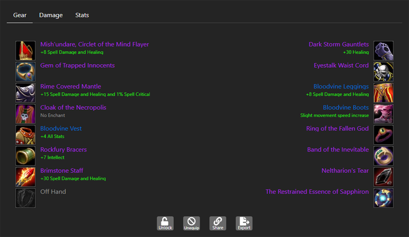

&nbsp;&nbsp;
&nbsp;&nbsp;
&nbsp;&nbsp;

# "By the great winds, I come." Classic Balance Druid Spreadsheet v1.8

One of the most advanced World of WarCraft Classic theorycraft resources for Balance Druid:

- Optimize your gear selection through various presets
- Determine your optimal trinket rotation through the trinket optimizer
- Emulate specific encounter scenarios (duration, buffs, debuffs, etc.)
- Gauge your Moonkin Aura DPS contribution to your party and raid
- Visualize how stats from gear, buffs, world buffs, and more adjusts your critical stat weights
- Save and publish your gear sets for later use or comparison
- Utilize high-risk, high-reward tables to maximize your gameplay
- Add or remove gear which you've collected to optimize any preset specifically for <b><i>YOUR</i></b> in game scenario
- And more...!

This spreadsheet is a resource which is primarily for Excel to utilize the power and functionality of VBA macros. <b>You will not be able to use this tool in Google Docs!</b>

  ---
  

<a href="#About"><b>About</b></a>&nbsp;|&nbsp;
<a href="#Spreadsheet"><b>Spreadsheet</b></a>&nbsp;|&nbsp;
<a href="#Spell-Penetration"><b>Spell Penetration</b></a>&nbsp;|&nbsp;
<a href="#Web-Application"><b>Web Application</b></a>&nbsp;|&nbsp;
<a href="#FAQ"><b>FAQ</b></a>&nbsp;|&nbsp;
<a href="#Resources"><b>Resources</b></a>&nbsp;|&nbsp;
<a href="#Author-Notes"><b>Author Notes</b></a>&nbsp;|&nbsp;
<a href="#Donation><b>Donation</b></a>&nbsp;|&nbsp;
<a href="#Credit"><b>Credit</b></a>

 

  ---

# About

This project was developed not out of the desire to play the Moonkin myself, but to justifiably refute accusations within the community as to how Balance Druid performs in a raid environment and if there was any validity to the claims players would make or if everything was hearsay. I went in with a unbiased opinion of the specs performance and detailed the process backed by mathematics. I can say with enough assurance that I can speak to the Balance Druid better than most. I hope you all can appreciate and enjoy the resource.

Balance Druid's stereotype which has carried through to today has been the notion that they run out of mana exceedingly fast, being coined "OOMkin". This is a verifiably false statement with the capability of being able to last nearly 5-minutes in the current state of the game. In hindsight Smite Priest, Shadow Priest, as well as Elemental Shaman have more mana management opportunities.

Moonkin as well as the Druid talent tree revamp came very late in the progression of Vanilla. The understanding and knowledge of the specialization couldn't be fully realized even partially through the evolution of the game due to these changes. In tandem with a bottom tier played class made for stand out research and data building incredibly sparse and inconsistent.

  ---

# Spreadsheet

By utilizing VBA macros you may optimize your gear down to exact value of a stat such as: Spell Hit, Spell Crit, Spell Damage, and more. This can be achieved by selecting your desired parameters in the <b>Character Selection</b> row and any additional <b>Settings</b> such as talents, buffs, and debuffs. Once selected you may click <b>Final Optimal Gear Set</b> and if you desire an even more exact optimization then click <b>Exact Optimization</b> at the bottom of the page.

<b>Only useable in Microsoft Excel!</b>

The Score function is the culmination of the stat weights via each individual item which has been selected. All of these parameters can be saved and called upon at a later load of the resource.

The spreadsheet also comes equipped with a rough estimation of the DPS that you may be able to produce with the given parameters. Tthis is not a perfect simulation of damage and does have a inherent margin of error which comes with it. Additionally, Zephan from the Classic Warlock community designed a <b>Moonkin Aura</b> tool which generates a rough estimation of the DPS contribition it brings to the party and raid.

<i>NOTE: Currently Ignite is not supported and I'm looking for someone able to reconstruct the tool appropriately for the aura with Ignite included.</i>

## Spreadsheet Screenshots

Classic Balance Druid Intro         |  Character Sheet | Stat Weights       |  Customizable Gear Selection
:-------------------------:|:-------------------------:|:-------------------------:|:-------------------------:
 || |

#

### Trinket Optimization

This feature of the tool is extremely powerful, but is easily the most miss appropriated function of the entire sheet. As a summary the optimization done in this worksheet will allow you to optimize for specific duration fights, such as a raid boss, or even optimize a trinket rotation for a given duration for trash monsters. I will detail the basic function and steps in order to successfully utilize the tool:

- Depending on what <b>Phase</b> your parameter is set to on the <b>Character</b> sheet you will be able to select or deselect any trinkets you wish to optimize in your test
- If optimizing for a boss make sure that <b>Boss?</b> is selected to <b>Yes</b> and a duration is input in terms of <b>seconds</b>
- Click <b>Generate Item Assignments</b> and then <b>Optimization</b>
- Scroll over to the right of this page and you will see the breakdown of the trinkets it selected as optimal
- If you wish to optimize the trinket selection with the rest of your gear click over to the <b>Character</b> sheet and make sure the <b>Optimize Trinket</b> parameter in the <b>Character Selection</b> column is selected as <b>Yes</b>
- Click <b>Find Optimal Gear Set</b> and then <b>Exact Optimization</b> at the bottom of the page if desired

- If you wish to optimize for a trash rotation then you will want to make sure <b>Boss?</b> is checked as <b>No</b>

Please understand that the optimization will take an exceedingly long time to generate an accurate trinket-swap rotation. The longer the duration and the more trinkets selected will increase the permutations needing to be calculated through the macro. This can take upwards of 45 to 60 minutes to complete.

  ---

# Spell Penetration

Part of the work done to understand the class and specilization was to also determine whether or not <v>Spell Penetration</b> was going to be valuable to us when it became widely available in Phase 5. Up until this point there was very little credible data from Vanilla suggesting that any of the bosses in Classic had any discernable amount of resistances for Arcane, Fire, Frost, Nature, and Shadow.

In working with <a href="https://github.com/kmmiles"><b>Beef Brocolli</b></a> and <b>Balor</b> we were able confirm how much resistances each monster through Phase 5 <b><i>roughly</i></b> had. This was achieved by parsing thousands of hits from <b>Warcraft Logs Classic (WCL)</b> and cross referencing it with the spell hit and resistance formulas.

 
<strong>Target Spell Resistance Tables</strong>

| Enemy                            | Arcane   | Fire   | Frost   | Nature   | Shadow   |
| -------------------------------- |:--------:|:------:|:-------:|:--------:|:--------:|
| The Prophet Skeram (15263)       | 6.76     | 3.4    | ?       | 0        | 4.36     |
| Princess Yauj (15543)            | 5.56     | 0      | ?       | 0        | 0        |
| Lord Kri (15511)                 | 0        | 0      | ?       | 0.36     | 0        |
| Vem (15544)                      | 3.04     | 0      | ?       | 0        | 0        |
| Battleguard Sartura (15516)      | 0        | 4.68   | ?       | 0        | 5.16     |
| Fankriss the Unyielding (15510)  | 2.32     | 0.36   | ?       | 0        | 0        |
| Viscidus (15299)                 | 180.12   | 181.96 | ?       | 180.08   | 183.8    |
| Glob of Viscidus (15667)         | ?        | 1.4    | ?       | ?        | 2.24     |
| Princess Huhuran (15509)         | 0        | 2.32   | ?       | 2.0      | 0        |
| Emperor Vek'lor (15276)          | 0        | 0      | ?       | 1.88     | 0        |
| Emperor Vek'nilash (15275)       | IMMUNE   | IMMUNE | ?       | IMMUNE   | IMMUNE   |
| Ouro (15517)                     | 0        | 3.2    | ?       | 3.0      | 0        |
| C'thun (15727)                   | 0        | 0      | ?       | 0        | 5.56     |
| Kurinaxx (15348)                 | 0        | 1.32   | ?       | 0        | 3.04     |
| General Rajaxx (15341)           | 0.2      | 0      | ?       | 0.04     | 1.72     |
| Moam (15340)                     | 0.2      | 0.96   | ?       | 0        | 0        |
| Buru the Gorger (15379)          | ?        | ?      | ?       | ?        | ?        |
| Ayamiss the Hunter (15369)       | 0        | 2.48   | ?       | 0        | 0.84     |
| Ossirian the Unscarred (15339)   | 243.08   | 249.32 | ?       | 237.88   | 245.52   |
| High Priest Venoxis (14507)      | 0.48     | 0.8    | ?       | 0        | 0        |
| High Priestess Jeklik (14517)    | 0        | 0.16   | ?       | 4.8      | 0.84     |
| High Priestess Mar'li (14510)    | 5.36     | 0      | ?       | 6.6      | 0        |
| Bloodlord Mandokir (11382)       | 1.12     | 0      | ?       | 2.68     | 3.76     |
| Gri'lek (15082)                  | 1.16     | 0      | ?       | 0        | 0        |
| Hazza'rah (15083)                | 2.8      | 6.36   | ?       | 0        | 0        |
| Renataki (15084)                 | ?        | ?      | ?       | ?        | ?        |
| Wushoolay (15085)                | ?        | 42.68  | ?       | ?        | 11.28    |
| High Priest Thekal (14509)       | 0        | 0      | ?       | 0.48     | 0        |
| Gahz'ranka (15114)               | 0.36     | 0.16   | ?       | 3.32     | 0        |
| High Priestess Arlokk (14515)    | 0.96     | 0      | ?       | 0        | 0.56     |
| Jin'do the Hexxer (11380)        | 1.2      | 1.44   | ?       | 0        | 0        |
| Hakkar (14834)                   | 0        | 0      | ?       | 8.72     | 0        |
| Razorgore the Untamed (12435)    | 7.2      | 5.48   | ?       | 0        | 0        |
| Vaelastrasz the Corrupt (13020)  | 0        | IMMUNE | ?       | 0        | 0        |
| Broodlord Lashlayer (12017)      | 0        | 0.0    | ?       | 0        | 10.56    |
| Firemaw (11983)                  | 3.8      | IMMUNE | ?       | 0        | 0        |
| Ebonroc (14601)                  | 0        | IMMUNE | ?       | 0        | 5.0      |
| Flamegor (11981)                 | 0        | IMMUNE | ?       | 0.08     | 1.8      |
| Chromaggus (14020)               | 273.36   | 274.96 | ?       | 274.6    | 274.84   |
| Nefarian (11583)                 | ?        | ?      | ?       | ?        | 0.92     |
| Onyxia (10184)                   | 0        | IMMUNE | ?       | 3.16     | 2.48     |
| Lucifron (12118)                 | 0        | 84.36  | ?       | 0        | 183.88   |
| Magmadar (11982)                 | 0        | 0      | ?       | 0        | 0        |
| Gehennas (12259)                 | 0        | 180.4  | ?       | 0        | 83.8     |
| Garr (12057)                     | 1.88     | 0      | ?       | 0        | 0        |
| Shazzrah (12264)                 | 213.24   | 106.8  | ?       | 81.88    | 97.28    |
| Baron Geddon (12056)             | 0        | IMMUNE | ?       | 0        | 2.24     |
| Golemagg the Incinerator (11988) | 0        | 176.8  | ?       | 0        | 1.08     |
| Ragnaros (11502)                 | 0        | IMMUNE | ?       | 0        | 0        |

As we can see from the tables, <b>Spell Penetration</b> is nearly as useless as it was once previous thought. Only a handful of bosses, mostly in Molten Core, even have resistances worth reducing. Frost Resistance data is also incomplete due to the unique mechanics of Frostbolt.

Credit to <a href="https://github.com/kmmiles"><b>Beef Brocolli</b></a> for designing the WCL scraper. You can view some of his Codepen process <a href="https://codepen.io/beef_broccoli/pen/zYqrBxw">here</a>.

  ---

# Web Application

The spreadsheet has also been adapted to a easy to use web based application designed by <a href="https://github.com/kmmiles"><b>Beef Brocolli</b></a>. This is a great alternative for any user that isn't able to access Excel. The application doesn't have all of the features of the spreadsheet, but it will generate the same best in slot results if you're looking for a quick dive into what gear you should be acquiring.

Access the web application by clicking on the . The link is also at the top of the page and inside the spreadsheet itself. 

  ---

# FAQ

### Q: The DPS looks low, is that accurate?

A: Yes. Balance Druid won't shock and dazzle. Our most unique fight opportunities come with Chromaggus's Arcane Invulnerability shimmer which is 400% more damage taken and Loatheb's Fungal Bloom buff which should give you a permanent 100% Critical chance to Starfire, reducing its spell cast permanently to 2.5 seconds.

### Q: Will guilds accept me for my utility with a Battle Ressurection, Innervate, and Moonkin Aura?

A: No, atleast they shouldn't. Battle Ressurection and Innervate are handicap utility mechanics which should not be a selling point. Remember that this is not 2006. Innervate is yours in this day of age, not anyone else's. Moonkin Aura also isn't going to replace a full DPS. It's roughly a ~100 DPS increase to a group of Warlocks in the early stages of the game and roughly a ~150 DPS to a group of Fire Mage's in the later stages.

Moonkin Aura loses its value the more Spell Critical chance your party has. It has great uses for the casters which have died and lost all of their buffs. It will help close the gap between non-world buffed players versus world buffed players for the remainder of the raid.

### Q: Should I be the Druid using Faerie Fire?

A: Optimally? No. However, if you don't have a Feral Bear or Restoration Druid then it should fall onto yourself. Additionally, if you're Alliance and your guild utilizes <b>Improved Exposed Armor</b> you should be pairing your Faerie Fire casts with <b>Holy Sunder</b> via <b><a href="https://classic.wowhead.com/item=7344/torch-of-holy-flame">Torch of the Holy Flame</a></b>.

### Q: Do I really resort to Starfire spam?

A: It's your best source of damage. Wrath has very niche uses during specific occasions. During Phase 1 and Phase 2 we'll have 16 debuffs with no way of filling all 16 slots with optimal effects. At most only 10 can be filled optimally, which leaves 6 open slots. These should theoretically be given to 6 Warlocks and/or 6 Shadow Priests, but if not then there may be room for Moonfire.

### Q: I heard that going Cat Form vs Vaelastrasz the Corrupt is optimal, is this true?

A: Absolutely, at least until you can acquire Rank 7 Starfire with considerable gear. Carrying around a Feral set with Manual Crowd Pummeler is exceptional for this fight in particular due to the unlimited resources. I have pulled near ~1200dps in Phase 3&4 by going Cat in this fight. You don't even need to change talents in order to perform this well.

### Q: Should I go for 16% Spell Hit as soon as possible?

A: It depends on your play style as well as your raid. If you encounter slower kills then you may want to utilize the extra Spell Hit%. If your fights can be calculated then you may want to utilize the <b>Spell Hit Optimization</b> charts to maximize your DPS potential. Be warned though you will essentially be rolling the dice with RNG. You could either be severely punished or severely rewarded for this style of play. The best answer would to find a medium, which both the spreadsheet and the web application both suggest as optimal.

### Q: Is it worth using a 5% Spell Hit set for trash?

A: I think it is. We're already a poorly built class so we should be doing whatever possible to pump. Utilizing a trash DPS set is roughly a ~10% DPS increase from your previous standing parses.

### Q: The spreadsheet values Spell Penetration at 0, why?

A: If you look at the <b>Weights</b> tab and scroll to the right of the page you will see that Spell Penetration is actually weighted correctly. However, per the resistances data from above the value of the stat is nearly worthless. For this reason I deliberately forced the tool to calculate it with a value of 0.

### Q: Why is Spirit and MP5 not present in your calculation?

A: Spirit and MP5 only have value if you have run out of mana. This isn't only true for Balance Druid, but for any class. These stats are considered handicaps and hinder your ability to do DPS. It is always more mana efficient to downrank your spell versus trying to stack Spirit and MP5, which leaves no room for prioritizing Spirit and MP5.

### Q: Are you sure I will have enough mana for raids?

A: In Classic the majority of fights will take you no longer than 60 seconds to finish. Once your raid has farmed enough gear you'll push over raid bosses like they were trash, i.e. Lucifron dead in 10-15 seconds. There are a few exceptions:

1. Progression during some raids may end up being a bit more mana intensive. In this instance I would educate using R1 Starfire when you've depleted your consumables and Innervate.
2. Loatheb, Patchwerk, and Sapphiron can be considerably long, to the point where you're just barely finishing the fight with mana. You may have to utilize R1 Starfire in this instance.

### Q: How good is Regalia of Undead Cleansing?

A: It's actually not bad. If we're talking about best in slot gear, it falls short. However, it's the best option for trash DPS and will be your best in slot option until you're able to get closer to an optimal set up. The reason that it can be so good is that the specific "damage vs Undead" set bonus double dips. Once for the normal calculation and then a second time for the critical hit calculation (i.e. 1.02 * 1.02).

  ---

# Resources

- <a href="Sheets/Classic_Balance_Druidv1.8.xlsm">Classic Balance Druid Spreadsheet</a>
- <a href="https://kmmiles.gitlab.io/moonkin-calc/">Moonkin Calculator (Web Application)</a>
- <a href="https://discord.gg/SMwmrBV">Druid Classic Discord</a>
- <a href="https://discord.gg/DwbRKh">Classic Theorycrafting Discord</a>

&nbsp;

  ---

# Author Notes

I've played World of Warcraft from Beta through Wrath of the Lich King. Proficient in Restoration Shaman for the majority of my career with my beginnings as a Restoration Druid in Vanilla.

I predominantly played in a hardcore raiding guild, Coalition, on Nostalrius. During the Nostalrius to Elysium transition I became integrated into the Quality Assurance team. During my time on Nostalrius, as well as being apart of the QA team, the development of Balance Druid theorycraft began.

I've been an integral part of the Classic World of Warcraft theorycraft community and have been a reliable resource of information and knowledge on the inner workings of World of Warcraft emulation as well as how technical mechanics worked in Vanilla.

  ---

# Donation

It has been quite the endeavor embarking on this project only to see it near its final completion and ending almost <b><i>5 years later</i></b>. I never would have thought I would invest so much time into something so mundane for so long. Nevertheless the pursuit of factual evidence versus archaic information and unproven claims is what kept me going. It truly became a passion.

If you'd like to support the project and what it has been able to offer to you and/or the community. Please, feel free and click <b><a href="https://www.paypal.com/paypalme2/keftenk?locale.x=en_US">here</a></b>. You can also click the PayPal link at the top of the page or the link inside the spreadsheet.

  ---

# Credit

Viper, Daemon, Nano, Brotalnia, Taladril, Shedo, Zephan, Guybrush, Ayz, Beef Broccoli, Balor, Nostalrius Guild: Coalition and NOPE, WoW Classic Guild: Pretty Good, and Azuregos.
